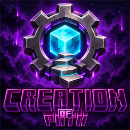

# Path of Creation · 创世之径

简体中文 · [English](docs/en/README.md)

  

**从一个方块开始，一步步创造属于自己的世界。**

Path of Creation 是一个以科技发展与自动化为核心的 Minecraft 空岛整合包。你将出生在虚空中的单方块空岛上，利用整合包提供的交互机制与自定义配方获取最初的资源，再逐渐搭建产线、发展能源、探索维度，走上创世之径。

[下载 v0.1.1](https://github.com/RainRaf-UwU/Path-Of-Creation/releases/tag/v0.1.1) · [全部版本](https://github.com/RainRaf-UwU/Path-Of-Creation/releases) · [反馈问题](https://github.com/RainRaf-UwU/Path-Of-Creation/issues)

## 整合包特色

- **单方块空岛开局**：从有限的起点获取资源，把虚空中的落脚点扩建成自己的世界。
- **自定义资源获取**：通过方块交互、流体转化、雷击、维度转换等机制推进发展，具体条件可在任务书与 JEI 中查看。
- **科技与自动化**：围绕机械动力、通用机械、应用能源 2、工业先锋、Oritech、末影接口等模组建设产线，把手工生产逐步转为自动化。
- **专属机器与材料**：包含自定义流体处理、复制、染色、虚空采矿等机器，以及贯穿进度的材料、升级与终极物品。
- **中英文任务引导**：前五章共 450 个任务，通过章节目标连接不同科技阶段；第六章尚未完成，仍在制作中。
- **客户端更新提示**：包含自动更新模组，启动游戏时检查正式 Release，可选择立即更新或稍后再说。

## 任务进程

| 阶段 | 章节 |
| --- | --- |
| 第一章 | 无中生有 |
| 第二章 | 苦尽甘来 |
| 第三章 | 探明真相 |
| 第四章 | 创世之径 |
| 第五章 | 创造模式？ |
| 可选第六章 | 登神长阶（未完成，制作中） |

任务书既是引导，也是进度的一部分。每章的终极物品关系到下一章的解锁；遇到陌生材料或特殊操作时，先阅读任务说明，再查看 JEI 的配方与用途。

## 运行环境

| 项目 | v0.1.1 使用版本 |
| --- | --- |
| Minecraft | 1.21.1 |
| 模组加载器 | NeoForge 21.1.255 |
| Java | 21 |

## 安装与开始游玩

1. 在支持 NeoForge 的 Minecraft 启动器中创建独立实例，安装 Minecraft **1.21.1** 与 NeoForge **21.1.255**，使用 **Java 21**。
2. 从 [Release 页面](https://github.com/RainRaf-UwU/Path-Of-Creation/releases/tag/v0.1.1) 下载 `path-of-creation-update.zip`，将其中的整合包文件解压到该实例的游戏目录。首次安装必须先完成上一步的游戏与加载器安装。
3. 启动游戏，使用 Skyblock Builder 的空岛世界类型创建新世界，使用整合包提供的 **Rain** 岛屿模板。
4. 打开 FTB Quests 任务书，从“欢迎”和“第一章：无中生有”开始。

更新 ZIP 提供模组、脚本、配置和资源，不包含 Minecraft 本体、Java 或启动器运行库。GitHub 的 `Source code` 压缩包是仓库源码快照；自动更新功能使用的是上述专用更新 ZIP。

## 已有实例如何更新

已包含自动更新模组的客户端会在启动时提示新版本。选择更新，等待下载与校验完成后点击“退出并安装”，安装结束后从启动器重新启动。

更新器会备份被替换的受管理文件，并保留存档、玩家额外添加的模组和常见个人设置。升级前仍建议自行备份重要存档。旧客户端若没有自动更新模组，需要先手动安装一次包含该功能的版本；Minecraft 或 NeoForge 版本变化时，需要通过启动器更新运行环境。

## 语言与启动器图标

支持简体中文与 **English (US)**。在游戏“选项 → 语言”中切换，FTB Quests 的语言覆盖选项保持空白，再重开任务书。自定义物品、提示、剧情及更新界面会使用所选语言。

PCL 用户可将 `config/fancymenu/assets/pack_icon.png` 设置为版本图标；Release 同时提供 256×256 图标和高清 Logo。

## v0.1.1 更新内容

- 新增 English (US) / en_us 支持：补齐 290 项 FTB Quests 文本，覆盖章节、任务标题、说明与提示。
- 完善 KubeJS 英文支持：物品提示、创造元件名称、建筑模板名称、隐藏成就、剧情打字效果及答题提示；剧情按各玩家的语言显示，保留中文。
- 为 FancyMenu 彩蛋提示和客户端更新界面添加中英文文本。
- 修复建筑小帮手模板无法显示、无法载入的问题：进入世界时补齐 7 份任务建筑数据，已领取模板继续可用，保留玩家已有建筑。
- 修复更新说明正文被背景模糊覆盖的问题。
- 更新整合包 Logo：融入原有标题图片，调整齿轮、光照与紫色虚空背景；提供 256×256 PCL 图标和高清版本，本机 PCL 已安装新版图标。
- 完善中文 README，新增完整英文 README 与语言切换链接；明确第六章尚未完成、仍在制作中。

## v0.1 更新内容

- 更新了若干 Mod。
- 修复已知 Bug。
- 优化整合包任务线。

## 项目结构与维护

| 目录 | 内容 |
| --- | --- |
| `kubejs/server_scripts` | 配方、资源获取、游戏事件与自定义机器逻辑 |
| `kubejs/startup_scripts` | 自定义物品、方块及启动注册 |
| `kubejs/client_scripts` | 客户端脚本 |
| `kubejs/assets` / `kubejs/data` | 贴图、模型、数据与配方定义 |
| `config/ftbquests/quests` | 任务章节、依赖与中英文文本 |
| `config/skyblockbuilder` | 空岛生成配置与模板 |
| `mods` | 当前整合包的模组文件 |
| `tools/poc-updater` | 自动更新模组源码、打包与验证工具 |

作者发布、编译与验证步骤见 [自动更新说明](tools/poc-updater/README.md)。

## 反馈与许可

发现问题请提交 [Issue](https://github.com/RainRaf-UwU/Path-Of-Creation/issues)，说明整合包版本、复现步骤，并附上相关日志或截图；上传前请移除账户信息等个人数据。

本仓库原创代码按 [MIT License](LICENSE) 发布。所包含的第三方模组、资源包与光影遵循各自作者的许可。
