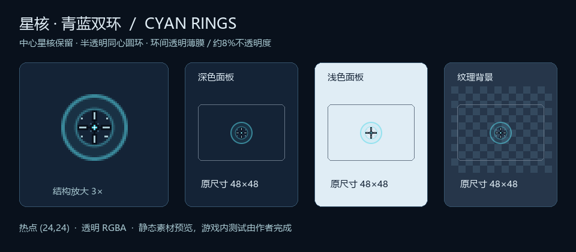

# 星核 · 青蓝双环与透明薄膜光标

用户指定内外环均为半透明青蓝圆环，并在两环之间加入透明薄膜。本版保留星核与定位刻线；外环#58D9EA、alpha140/255（约55%不透明度）、半径17.5px、宽2px；内环同色、alpha110/255（约43%）、半径10.25px、宽1.3px；膜同色、alpha20/255（约8%）。边缘平滑，背景可透过环与膜。尺寸48×48、热点(24,24)，中心白点负责点击；原有点击动画和特殊光标兼容保持。

- `assets/cursor.png`：独立48×48 RGBA素材。
- `tokens.json`：配色、尺寸、热点和既有点击效果参数。
- `preview.html`：静态稿与带中心热点的浏览器指针预览。
- `PRD.md`、`TECH-SPEC.md`、`DESIGN.md`、`QA.md`：需求、原生限制、冻结视觉及静态核对说明。
- 可编辑生成器在 `tools/poc-cursor/build_assets.py`，运行资源在该工具的 `src/main/resources/`，本地安装为 `mods/poc-cursor-1.0.0.jar`。

本轮已编译并安装，未运行游戏或原生窗口测试。完整退出并重启客户端后，以中心白点检查按钮与槽位点击位置、章节切换、GUI缩放和文本/手形等特殊指针。旧版实测记录在 `tools/poc-cursor/verification.json` 的 `previous_build_validation` 中，不作为新样式的实机证据。

原模组和19项旧素材/源码/文档保存在 `.cache/cursor-star-core-20261009/before/`。本轮没有修改点击音效、任务、JEI配方、个人开关、存档或其他模组，也没有提交推送。

细节增强前的19项源码/素材/文档及JAR另存 `.cache/cursor-star-core-details-20261009/before/`，可恢复上一版星核样式。

圆环版接入前的28项素材/源码/设计文档和JAR保存在 `.cache/cursor-cyan-ring-20261009/before/`。当前静态稿使用真实alpha合成，背景可透过青蓝圆环。

当前双环膜版接入前的28项文件与JAR另存 `.cache/cursor-cyan-film-20261009/before/`。旧青紫内轨道已替换；中心半径8.5px及所有保留星核/定位刻线不透明像素逐点核对。
