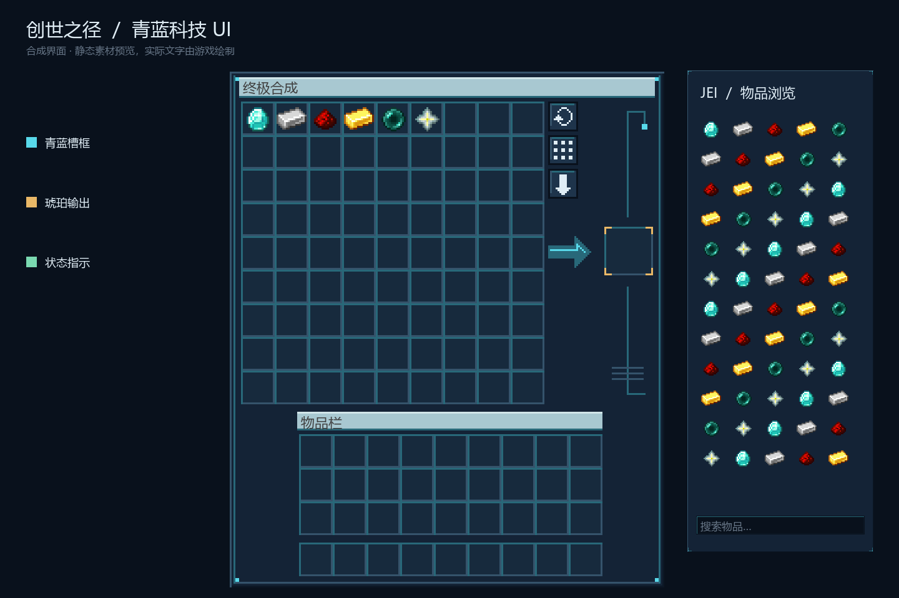
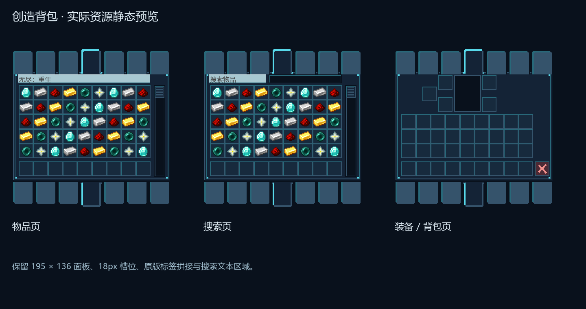
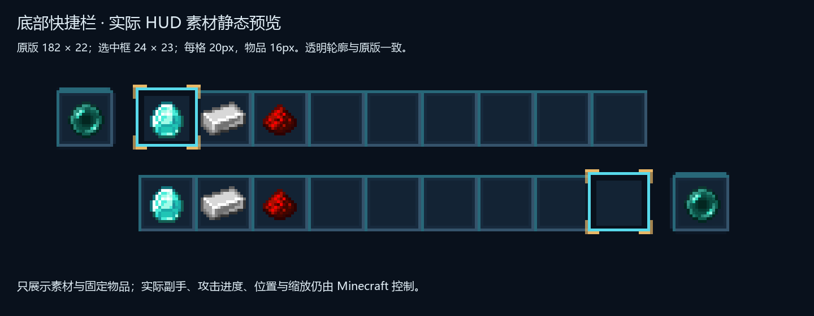
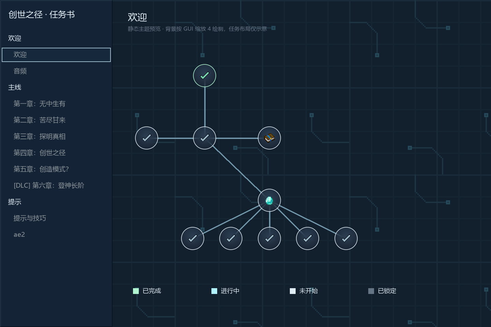
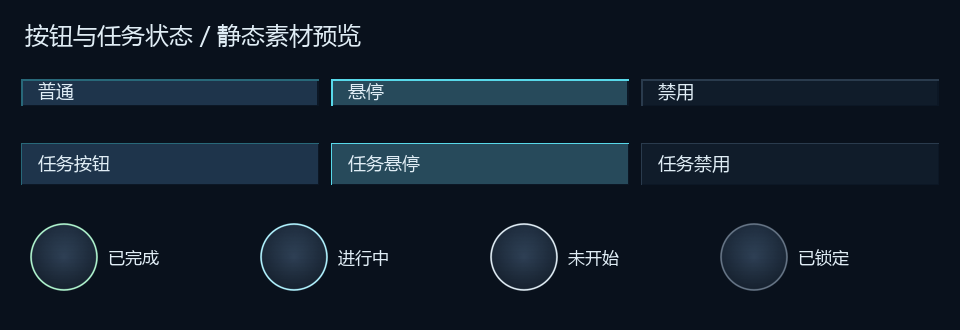

# 创世之径 · 青蓝科技 UI

> 2026-10-08 五页细节改版已接入；当前入口、预览和检查见 [ui-polish-2026-10-08](../ui-polish-2026-10-08/README.md)。本目录保留基础几何与历史记录，直接运行旧版 `--install` 会覆盖新增细节。

为现有科技整合包制作的资源皮肤。深蓝金属底板、青蓝槽框与电路、琥珀色输出口；布局、物品点击区域和任务进度继续由原模组控制。

## 使用

已切换为 **KubeJS 自动加载**：全部素材保留在 `kubejs/assets/`，由 `mods/kubejs_lang_override-1.21.1-neoforge-1.0-poc.jar` 提升资源优先级，不需要单独启用 UI ZIP。

**首次切换请彻底退出并重新启动游戏。** 新增模组无法通过 F3 + T 载入。以后只更新贴图和主题时，可用 F3 + T 重载，再重新打开对应界面。

用户已确认第 2 版补丁的启动问题解决。本轮修复快捷栏与任务显示，仅更新素材；按 F3 + T 重载，关闭再打开任务书即可。

旧 UI ZIP 已移出 `resourcepacks/` 并保存在本地备份，options 中只移除了这个 UI 包；其他已选包保留。

本轮没有自动启动或操作游戏。以下图片是静态素材预览，游戏字体、物品模型、状态叠加、缩放与按钮位置以实际模组绘制为准。

Git 上传包含本目录素材、生成脚本、补丁源码、检查源码、静态预览，以及 `kubejs/assets/` 中的 125 个运行资源和自动加载补丁 JAR。按项目规则，README 之外的 Markdown 与本地缓存不上传。新安装实例需完整重启以载入补丁，之后素材更新可用 F3 + T；不要同时启用旧 UI ZIP。

2026-10-09 本次上传以本目录已验证的素材为版本来源。原实例后续已有独立的 UI 细节改版，上传时不覆盖这些本地文件；该后续改版、光标和其他工作不属于此提交。

## 覆盖范围

- Extended Crafting：3×3 / 5×5 / 7×7 / 9×9 手动工作台。
- Re-Avaritia：终极合成。
- Crafting Tweaks：旋转、均分、搬入按钮，保留原图集坐标与操作图标。
- 原版：生存背包、创造物品页/搜索页/装备页、28 个创造标签状态、2 个滚动条状态、工作台、通用箱子、通用按钮与输入框。
- 世界快捷栏：9 格底板、选中框、左右副手槽、快捷栏攻击指示，共 6 个 sprite；保留原透明度及物品坐标。
- JEI：物品栏、收藏栏、搜索框、按钮、滚动条及配方卡；配方卡保留浅色底板，以兼容第三方固定深色文字。
- FTB Quests：任务书背景、章节侧栏、选择高亮、详情、按钮、文本、状态颜色、连线、完成图标与 9 种节点背景；不改几何形状或点击遮罩。
- FTB Library：任务节点使用的普通及完成勾选图标，保留轮廓透明度。

自动工作台、其他机器的专用 GUI、快捷栏以外的世界 HUD、小地图和主菜单布局不属于本轮范围。

## 交付文件

- `assets/`：可独立使用的 PNG、纹理元数据、FTB 主题及 JEI 颜色。
- `preview.html` 与五张 PNG：静态预览；任务背景按 GUI 缩放 4 绘制。
- `tokens.json` / `DESIGN.md`：颜色与组件规格。
- `PRD.md` / `TECH-SPEC.md`：范围及技术边界。
- `manifest.json` / `verification.json` / `QA.md`：资源尺寸、哈希和检查记录。
- `build_ui.py`：从实际已安装模组的几何生成资源，默认仅暂存；`--install` 接入本地。
- `prepare_override.py` / `override-src/`：从原始下载重建兼容补丁，适配本地资源名称并安全复制资源列表，输出到缓存；不修改 KubeJS 主模组。
- `checks/`：不可修改列表、原生资源管理器、Moonlight 过滤路径与 FTB 主题的回归检查源码。
- `Path-of-Creation-Cyan-UI.zip`：保留的可选导出文件；当前实例不安装或启用它。

## 自动加载模组

使用作者的 [KubeJS Assets Override 1.21.1 NeoForge 1.0](https://www.curseforge.com/minecraft/mc-mods/kubejs-assets-override/files/8712379)，依赖 KubeJS build.277 或更新版本。本地 build.377 满足要求。

原版模组只匹配 `KubeJS Resource Pack [assets]`，而当前 KubeJS 使用 `KubeJS File Resource Pack [assets]`。首次兼容修正只替换名称，随后用户的 13:09:58 崩溃报告揭示原方法会调用 `clear()` 修改调用方列表，遇到 Moonlight 的不可修改列表时抛出 `UnsupportedOperationException`。

当前为第 2 版兼容补丁：使用 `@ModifyVariable` 替换客户端构造参数，以新列表将 KubeJS 文件层移到最后，保留其他资源层的相对顺序，不修改传入列表。服务端数据包返回原列表。只替换该 Mixin 类；原依赖元数据、客户端配置、许可证和其他文件逐字节保留。名称仍添加 `-poc`，JAR 内 `META-INF/poc-local-patch.json` 记录来源、源码哈希与修改。原下载和上一版补丁均保留在缓存，没有修改 KubeJS 主模组。

原文件 SHA-256：`d4c62f4b7a5c389f62099b00bb62280a8b174d4bf935e16349bdd5e9b0fab014`。
当前兼容文件 SHA-256：`e07212231918109a504e58739ded9ae366b28229a851f0b6628bc60bd20ad8e1`。

## 已检查与待检查

91 张 PNG、33 个 JSON/元数据文件、12 个不同主题资源引用通过检查。FTB Quests 已安装版本解析 45 项主题属性，FTB Library 解码 21 项图标与 20 项颜色。四级工作台的全部输入、背包槽与输出槽位置核对原图，输出槽另核对容器类字节码。创造背包 150 个槽位坐标与 33 张素材的 alpha 保持原版。6 个 HUD sprite 与 2 个通用勾选图标的 alpha 保持原版，副手物品位置核对 Minecraft Gui 字节码。可选导出 ZIP 内容与暂存资源逐项一致。

侧栏大色块源于 PartIcon 默认按 256×256 图集采样 32×32 面板，现对全部 11 个面板显式指定实际尺寸。章节文字会被 FTB 按 HSV 明度固定减亮 0.35，已提高状态色明度并降低选中背景亮度。通过原生颜色方法检查，完成、进行中、未开始文字在普通和选中行的最低对比度分别为 4.78、5.06、4.98。节点中的通用勾选来自 FTB Library，与主题完成叠加图标不同，已补齐两种图标。

首次检查只覆盖了 KubeJS 主加载路径的 ArrayList，漏掉 Moonlight 再构造资源管理器的不可修改列表。当前回归检查用上一版补丁复现同一异常；第 2 版处理 ArrayList、List.copyOf、Stream.toList、unmodifiableList 时均保留调用方列表，其他资源与服务端顺序不变，空列表和不含 KubeJS 的列表原样返回。

使用实际 Mixin 0.8.7 在独立 LaunchWrapper 检查进程中转换 Minecraft 构造方法，再运行转换后的类：直接传入未排序的不可修改列表，全部 125 个 UI 文件均从 KubeJS 读取且字节匹配，无 UI ZIP。实际 Moonlight FilteredResManager.including 的 Stream.toList 路径通过，FTB ThemeLoader 合并 2 份主题后完成颜色、连线颜色和勾选图标正确。本轮沿用已验证的转换类与原样保留的补丁 JAR，重新核对更新素材。该检查宿主并非完整 NeoForge 游戏环境，不能替代画面验收。

559 个任务、591 条依赖通过既有图审计。195 个任务、配方、脚本和个人界面配置文件在修复前后哈希保持一致，259 个原有模组文件大小与修改时间保持一致，KubeJS 主 JAR 哈希一致。本轮 options 无内容变化；汉化包和其他已选包保留。用户已确认第 2 版补丁启动成功，截图显示创造背包皮肤正常。本轮没有修改任何模组 JAR，新快捷栏与任务显示仍需重载后确认。

用户反馈后的修复：补齐此前遗漏的创造背包，降低网格和电路对比度。此前以置顶 ZIP 解决覆盖，现在按用户要求改为自动加载的优先级模组。章节侧栏折叠状态、任务缩放和节点位置未修改，侧栏收起时可点击左侧三角展开。

待用户重载后检查：快捷栏、选中框与左右副手槽，任务侧栏、不同状态章节文字与勾选图标；其他 GUI 缩放、任务详情与生存流程的完整验收仍未完成。

## 回退

本次资源、兼容模组、停用 ZIP 清单及 SHA-256 位于 `.cache/ui-tech-20261008/installation.json`。本轮修复前的素材和记录在 `.cache/ui-tech-20261008/hud-quest-repair/backup/`。启动修复前的补丁与安装记录在 `.cache/ui-tech-20261008/no-zip-switch/crash-fix-backup/`，旧补丁有已确认的崩溃问题，不建议恢复。若回到 ZIP 方案，关闭游戏后移出兼容模组，使用本目录当前导出 ZIP；旧备份 ZIP 只有此前的 117 个素材。若完全移除皮肤，只处理清单中仍匹配本次哈希的文件，不删除整个命名空间目录。恢复设置时只处理 UI 包条目。

FTB 主题机制参考 [官方说明](https://github.com/FTBTeam/docs/blob/main/mod-docs/mods/suite/Quests/Developer/Styling/index.md)，兼容性以本机 JAR 的主题入口与解析器为准。
